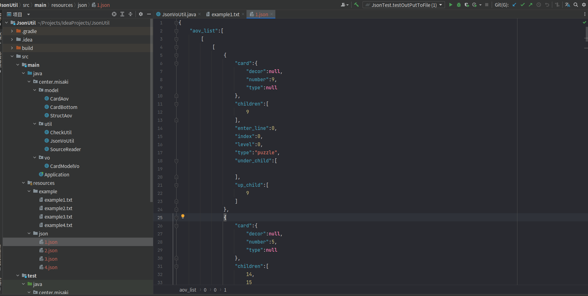
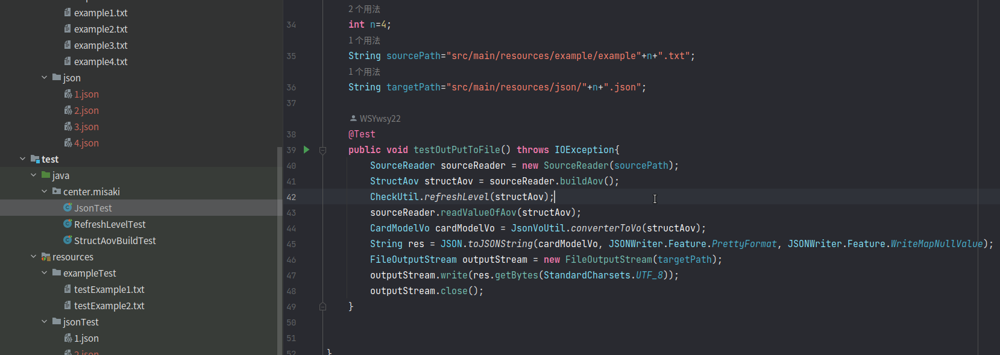

# 工具介绍

此工具是用于分析 Solitaire 游戏或其相关游戏的牌面结构。

### 工具实现思路：

牌面先确定数据结构，后输入数据，不关心解謎顺序，从而得到整个牌面的有限结构。

深度优先搜索，确定level等级，构造视图转换为JSON输出。

### 工具输入文件格式：

> [ 牌面上牌的数量 ]  [ 牌底牌的数量 ]
>
> [ 邻接矩阵 ]    //数据结构部分
>
> [ 初始化level 部分 ]  
>
> [
>
>  牌面赋值部分
>
>  牌底赋值部分
>
>  ]
>
> //以上阶段 邻接矩阵开始后面阶段均以 -1 结束

**示例**：

> ```
> 24 17
> 
> 0 9
> 1 9
> 1 10
> 2 10
> 2 11
> 3 11
> 3 12 
> 4 12
> 4 13
> 5 13
> 5 14
> 6 14
> 6 15
> 7 15
> 7 16
> 8 16
> 9 17
> 10 17
> 10 18
> 11 18
> 11 19
> 12 19
> 12 20
> 13 20
> 13 21
> 14 21
> 14 22
> 15 22
> 16 23
> -1
> 
> 0 1 2 3 4 5 6 7 8
> -1
> 
> 0 9 0 
> 1 13 0
> 2 7 0
> 3 5 0
> 4 9 0
> 5 12 0
> 6 5 0
> 7 2 0
> 8 12 0
> 14 13 1
> 12 10 1
> 13 9 1
> 20 11 2
> 21 6 2
> 9 7 1
> 16 13 1
> 15 12 1
> 10 11 1
> 11 6 1
> 19 1 2
> 22 3 2
> 23 6 2
> 17 2 2
> 18 8 2 
> 
> 25 4 -1
> 26 5 -1
> 27 9 -1
> 28 4 -1
> 29 12 -1
> 30 8 -1
> 31 4 -1
> 32 8 -1
> 33 1 -1
> 34 8 -1
> 35 2 -1
> 36 10 -1
> 37 11 -1
> 38 5 -1
> 39 1 -1
> 40 3 -1
> -1
> ```

### 工具工程目录截图：



### 使用方法：

* 第一种方法：直接运行编译完成的 **jar**  包  
  * 需要   **JDK8** 及其以上环境
  * 注意，**源文件需要书写绝对路径** 默认会在当前目录生成 json文件
  * **此方法运行须在输入文件第一行指定  关卡数字**

```java
java -jar JsonTool-1.0.jar [your sourcePath] 
```

* 运行工程目录下的 JsonTest  -> testOutPutToFile() 方法，修改参数运行。


